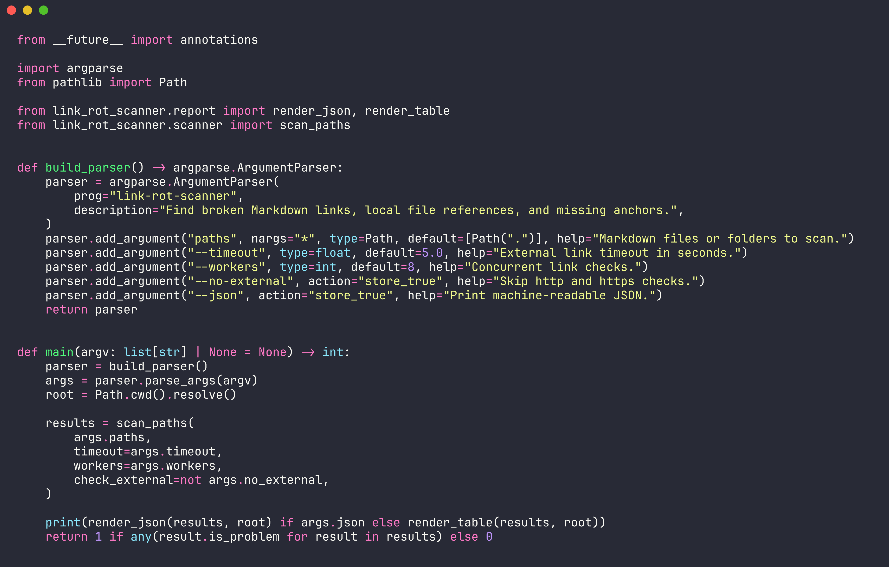
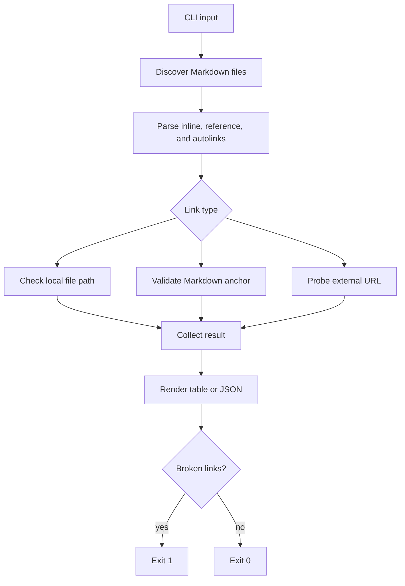

# link-rot-scanner

Fast Markdown link auditing for docs-heavy repos.

| Checks | Handles |
| --- | --- |
| Local files | `docs/setup.md`, `../README.md` |
| Markdown anchors | `guide.md#install-steps` |
| External URLs | `https://example.com` |
| Reference links | `[docs]: https://example.com` |



## Terminal


## Install

```bash
python3 -m pip install -e .
```

## Usage

```bash
link-rot-scanner README.md docs/
link-rot-scanner --no-external .
link-rot-scanner --json --timeout 2 --workers 16 .
```

## CLI Reference

| Argument | Default | Purpose |
| --- | ---: | --- |
| `paths` | `.` | Markdown files or folders to scan |
| `--timeout` | `5.0` | HTTP timeout in seconds |
| `--workers` | `8` | Concurrent link checks |
| `--no-external` | `false` | Skip `http` and `https` URLs |
| `--json` | `false` | Print machine-readable results |

## Workflow



## Output Contract

| Status | Meaning | Exit impact |
| --- | --- | --- |
| `OK` | Target exists or URL responds | Success |
| `BROKEN` | Missing file, missing anchor, or failed URL | Exit code `1` |
| `SKIPPED` | Unsupported scheme or disabled external checks | Success |

## Project Layout

```text
src/link_rot_scanner/
  cli.py       # command-line interface
  parser.py    # Markdown link extraction
  checker.py   # local and external validation
  scanner.py   # discovery and concurrency
  report.py    # table and JSON rendering
tests/
  test_parser.py
  test_scanner.py
```
