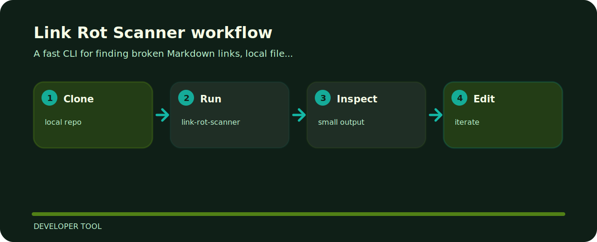

# Link Rot Scanner

This project is a small, inspectable developer tool tool. It prefers concrete examples and local files over hidden setup.


## Open these first

```text
src/            package source
tests/          test coverage
.gitignore      project file
pyproject.toml  package metadata
```

## Start here

```bash
git clone https://github.com/mertefekurt/link-rot-scanner.git
cd link-rot-scanner
python -m pip install -e ".[dev]"
link-rot-scanner --help
```

## Working map


